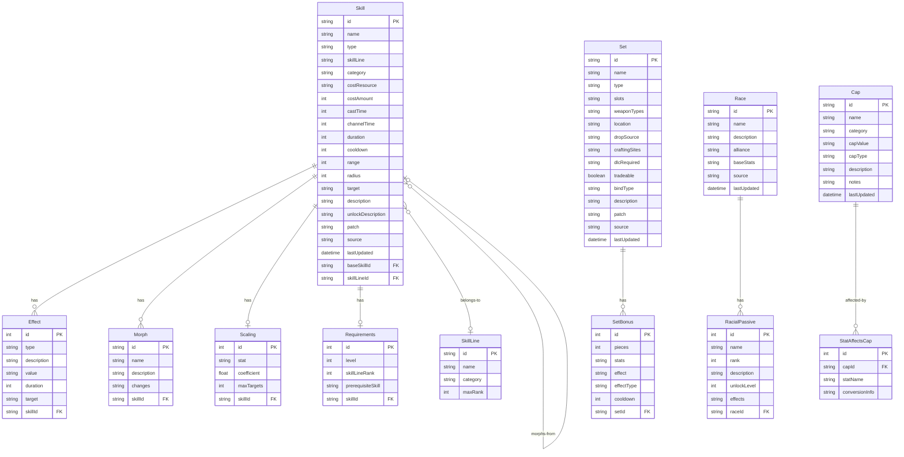
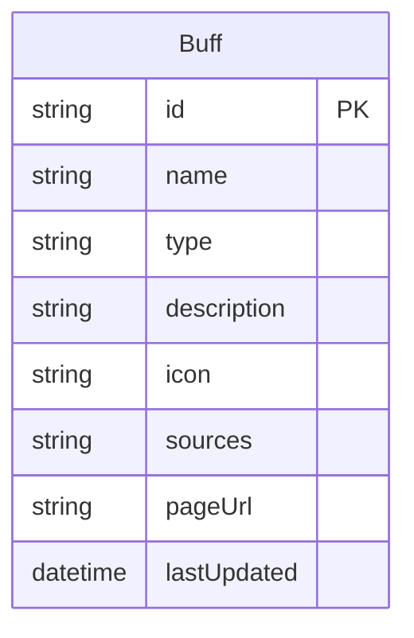
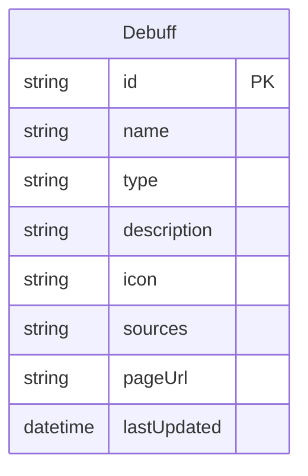
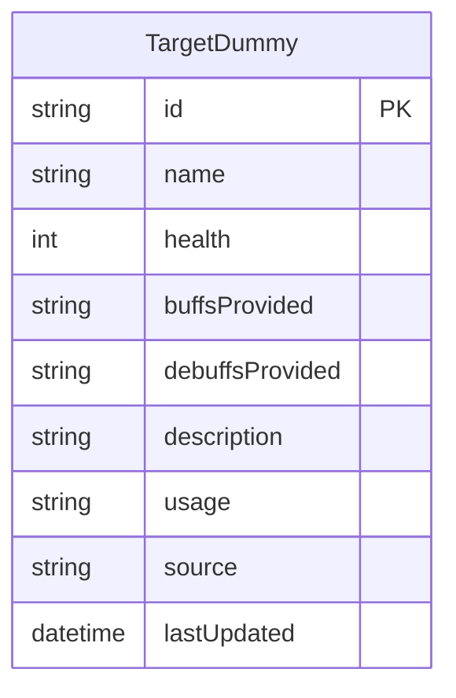
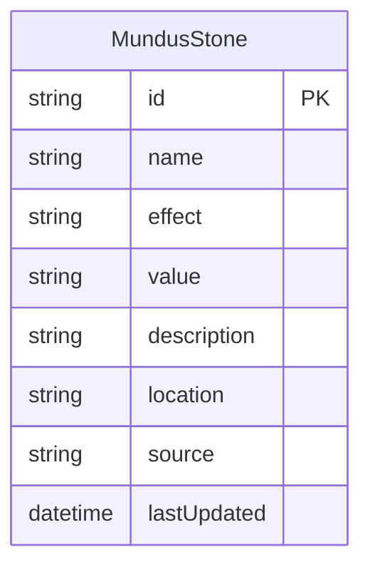
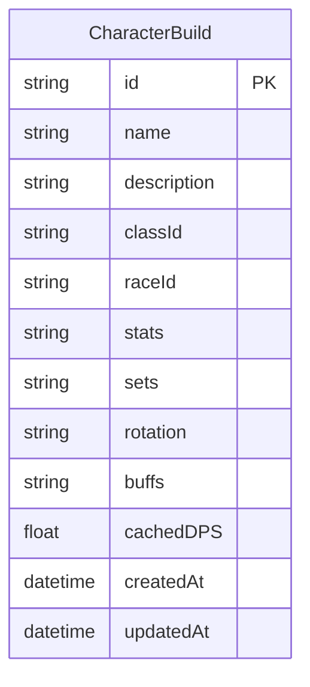
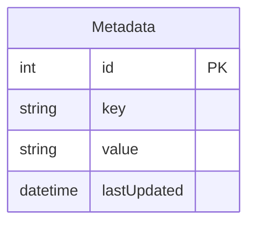
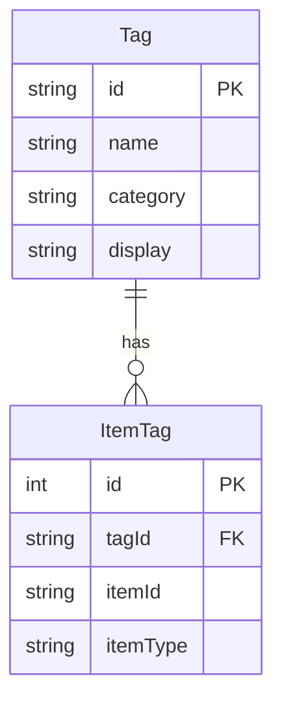

# ESO-MCP Database Schema

## Main Schema (Tables with Relationships)



## Standalone Tables (No Foreign Keys)

These tables have no foreign key relationships and are queried independently:

```mermaid
erDiagram
    Class {
        string id PK
        string name
        string description
        string source
        datetime lastUpdated
    }
```













## Entity Relationships Summary

| Parent | Child | Relationship |
|--------|-------|--------------|
| Skill | Effect | One-to-Many |
| Skill | Morph | One-to-Many |
| Skill | Scaling | One-to-One |
| Skill | Requirements | One-to-One |
| SkillLine | Skill | One-to-Many |
| Skill | Skill | Self-referential (morphs) |
| Set | SetBonus | One-to-Many |
| Race | RacialPassive | One-to-Many |
| Cap | StatAffectsCap | One-to-Many |

## Proposed Tag System



The `ItemTag` table uses a polymorphic pattern where:

- `itemId` = the ID from the source table (Skill, Set, Buff, etc.)
- `itemType` = which table it references ("skill", "set", "buff", "debuff", "mundus", "racial")

This enables queries like:

- Find all items tagged `major-force`
- Find all sets tagged `stamina`
- Find all skills tagged `healing`
